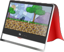

    
    <h3 align="center">2D Game Development: From Zero To Hero</h3>
    

        A compendium of the community knowledge on game design and development
         
        <a href="https://therealpenaz91.itch.io/2dgd-f0th"><strong>Get the Ebook »</strong></a>
         
         
            <a href="https://gitlab.com/Penaz/2dgd_f0th">GitLab Repo</a>
            ·
            <a href="https://github.com/2DGD-F0TH/2DGD_F0TH">GitHub Repo</a>
    

<!-- TABLE OF CONTENTS -->

    
Table of Contents

    <ol>
        <li>
            <a href="#about-the-project">About The Project</a>
            <ul>
                <li><a href="#project-health">Project Health</a></li>
            </ul>
        </li>
        <li>
            <a href="#getting-the-book">Getting The Book</a>
            <ul>
                <li><a href="#ready-to-read-version">Ready-to-read Version</a></li>
                <li><a href="#source-code">Source Code</a></li>
            </ul>
        </li>
        <li><a href="#screenshots">Screenshots</a></li>
        <li><a href="#contributing">Contributing</a></li>
        <li><a href="#license">License</a></li>
        <li><a href="#my-stance-on-ai">My stance on AI</a></li>
    </ol>

About the project
-----------------

This project aims to be a Creative Commons Licensed body of knowledge about game design and development.

As well as being a source of knowledge this project aims to be a learning experience for everyone involved too, by gathering contributions from the community, teaching others how to make a game, explaining algorithms but also learning tips and tricks from people who are more experienced.

### Project Health

**Commits:**

(<a href="#readme-top">back to top</a>)

Getting the book
-----------------

### Ready-to-read version

**As of March 21st, 2021 the ready-to-read versions of this book will be available (for free) only through Itch.io**

[Link to the Itch.io page](https://therealpenaz91.itch.io/2dgd-f0th)

I decided to use only Itch as it's more stable and not influenced by any kind of CI/CD issue or tantrum. I have to make the files and upload them there anyway, so I may as well use that page as my main point of download for the project.

Versions currently available: PDF and EPub

### Source Code

The source code for this ebook is available through the following official repositories:

- [Link to the GitLab Repository](https://gitlab.com/Penaz/2dgd_f0th/)
- [Link to the GitHub Repository](https://github.com/Penaz91/2DGD_F0TH)

You can learn how to build the book yourself in the Wiki!

(<a href="#readme-top">back to top</a>)

Screenshots
------------

(<a href="#readme-top">back to top</a>)

Contributing
------------

Hi! Penaz here.

After over 500 pages of content, I am reaching the point where I poured the majority of my knowledge inside this e-book, and simplifying and explaining takes away a lot of time. With the little time I have, research can only get me so far.

I'd love to translate the currently available listings many other languages, as well as add new algorithms, containers, tips and tricks and design patterns. Though my work leaves me very little free time (and energy) to study and re-work things in a more understandable way.

If you are a programmer, game designer, game developer, artist, writer or "game dev aficionado" that wants to contribute to a completely free and open resource for new game developers that want to start seriously; feel free to fork the repository and pour your knowledge in this magic soup that is this book!

I'm more than happy to take a look at pull requests, it would be a honor.

Also remember to put yourself in the CONTRIBUTORS section!

If instead there is something unclear about the book, or something you would like to see added, drop by the ISSUES section and leave a ticket there, I will try to fix it, or at least add a placeholder for the future.

Another way to contribute is to translate the entire book in another language! Check the Wiki for more information.

All contributions will be handled with maximum respect and in accordance to our [Code of Conduct](CODE_OF_CONDUCT.md).

Thank you for reading.

(<a href="#readme-top">back to top</a>)

License
--------

This project is licensed under the Creative Commons Attribution-NonCommercial-ShareAlike License.

[Learn more](/docs/license_reasoning.md)

(<a href="#readme-top">back to top</a>)

My stance on AI
---------------

Even though AI can be an undeniably useful tool in some situations, I seriously don't like the thought of seeing my (and other people's) hard work being mixed into what is essentially a probabilistic melting pot that can be used by unprincipled people for their own personal gain.

This means that any contribution that is found to be the product of generative AI will also immediately be deleted and the contributor may be banned from making further contributions if the usage of AI was done in bad faith.

This also means that any use of this book to train generative AI is **forbidden**.

AI is an ethical mess right now: books, blogs, microblogging posts are all melded together without any regard for copyright, correctness or quality into a result that is "semantically and syntactically *probably* correct" but is of inferior quality to the sum of its sources.

To that we have to add the issue of AI self-feeding: AI-generated solutions and posts are invading the Internet, which in turn will enter the generative AI training loop, lowering the quality of responses further.

I know that this is a further restriction on the "free as in freedom" principle of this project, and this book may not be "the ultimate Body of Knowledge" on game development, but I want it to be at least somewhat curated.

(<a href="#readme-top">back to top</a>)

